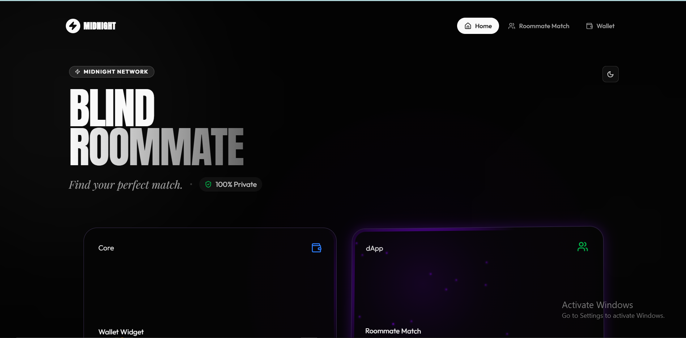
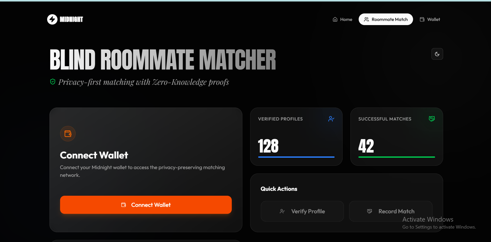
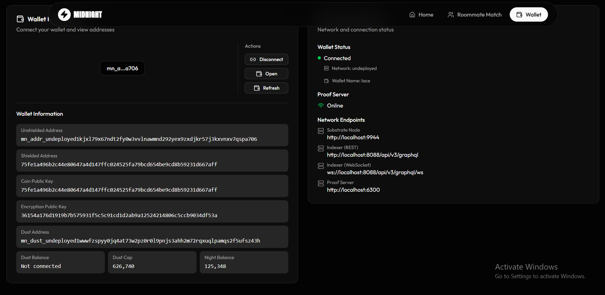

# 🏠 Blind Roommate Matcher

> **Privacy-First Roommate Matching with Zero-Knowledge Proofs**

A decentralized smart contract built on the [Midnight Network](https://midnight.network/) that enables roommate matching while preserving financial and personal privacy through zero-knowledge proofs.

## 🌟 What It Does

Finding a trustworthy roommate requires sharing sensitive information like bank statements, credit scores, and lifestyle habits. **Blind Roommate Matcher** solves this privacy problem by allowing prospective roommates to **prove financial reliability and lifestyle compatibility without revealing their actual data**.

Using zero-knowledge cryptography, users can demonstrate they meet requirements (e.g., "I earn above $X/month" or "I have compatible habits") without exposing the underlying information.

## ✨ Features

- **🔐 Privacy-Preserving Verification** - Prove financial reliability without sharing bank statements
- **🤝 Trustless Matching** - Match with compatible roommates without revealing personal details  
- **📊 On-Chain Transparency** - Public ledger of verified profiles and successful matches
- **⚡ Zero-Knowledge Circuits** - Powered by Midnight's Compact language for efficient ZK proofs
- 🌐 Decentralized - No central authority controls your sensitive data

## 📸 Preview

<div align="center">
  
  <br/><br/>
  
  <br/><br/>
  
</div>

## 🚀 Deployed Smart Contract

**Contract Address:**  
```
5b38666df5cbe6421a9388284efd6288e228ff8da204087deefdfc4e849f2722
```

**Network:** Midnight Local Testnet  
**Deployed:** February 14, 2026

## 🏗️ Technical Architecture

Built with:
- **Compact** - Midnight's smart contract language for zero-knowledge applications
- **Midnight Network** - Privacy-focused blockchain platform
- **TypeScript** - Deployment and interaction scripts
- **Level DB** - Local private state management

### Smart Contract Structure

```compact
// Public Ledgers
- verifiedProfiles: Counter    // Tracks total verified users
- successfulMatches: Counter   // Tracks total successful matches

// Circuits
- verifyProfile()   // Increments verified profiles count
- recordMatch()     // Records a successful roommate match
```

## 📦 Installation & Setup

### Prerequisites

- Node.js v18+
- WSL2 (for Windows users)
- Midnight Compact Toolchain

### 1. Clone the Repository

```bash
git clone <your-repo-url>
cd midnight-starter-template-windows
```

### 2. Install Dependencies

```bash
cd rommate-match-contract
npm install
```

### 3. Compile the Contract

```bash
npm run compile:rommate
```

This generates the necessary artifacts in `src/managed/rommate-match/`.

### 4. Deploy the Contract

```bash
npm run build
npm run deploy
```

The deployment information will be saved in `deployment.json`.

## 🎯 Usage Example

```typescript
import { verifyProfile, recordMatch } from './managed/rommate-match';

// Verify a new roommate profile
await verifyProfile();

// Record a successful match
await recordMatch();
```

## 🛣️ Roadmap

- [ ] Add financial threshold verification circuits
- [ ] Implement lifestyle compatibility scoring
- [ ] Create CLI for easy interaction
- [ ] Build web interface for non-technical users
- [ ] Deploy to Midnight Testnet
- [ ] Add encrypted messaging between matches

## 🤝 Contributing

Contributions are welcome! Please feel free to submit a Pull Request.

1. Fork the project
2. Create your feature branch (`git checkout -b feature/AmazingFeature`)
3. Commit your changes (`git commit -m 'Add some AmazingFeature'`)
4. Push to the branch (`git push origin feature/AmazingFeature`)
5. Open a Pull Request

## 📄 License

This project is licensed under the MIT License.

## 🔗 Resources

- [Midnight Network Documentation](https://docs.midnight.network/)
- [Compact Language Guide](https://docs.midnight.network/develop/compact)
- [Zero-Knowledge Proofs Explained](https://docs.midnight.network/learn/zkp)

## 🙏 Acknowledgments

Built with the [Midnight Starter Template](https://github.com/midnight-network/starter-template) and powered by zero-knowledge cryptography for a privacy-first future.

---

**⭐ If you find this project useful, please consider giving it a star!**
